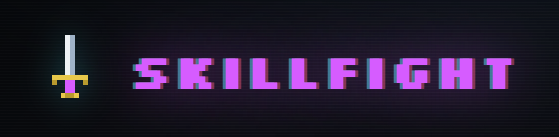

<p align="center">
  
</p>

# skillfight

**An arena where your Claude skills fight.**

You've installed a pile of Claude skills. Some of them overlap — two skills that
both want to fire for the same request, quietly fighting over Claude's behavior.
skillfight points at your skills folder, finds the overlaps, and tells you who
wins, what to merge, and what can coexist — with pros, cons, and a rationale you
can audit. It never deletes a skill; it advises, you decide.

```
  ./skills/*.md ──► engine ──► verdict (winner / merge / coexist) ──► arena
```

A run is **local and stateless**: it reads your skill `.md` files, sends them to
the model **you** pick (Anthropic, OpenAI, or a local model), and renders the
result as an ASCII fighting arena — the same view in your terminal and in the
browser.

## Install

Requires **Node 20+** and **pnpm**.

```bash
git clone https://github.com/MasterYoav/skillFight.git
cd skillFight
pnpm install
pnpm build
```

## Use

Point the TUI at a folder of skills (recurses; a skill is any `.md` with a
frontmatter `description`):

```bash
pnpm tui ~/.claude/skills            # the fighting arena, in your terminal
pnpm tui:demo                        # see it with sample data, no key needed
```

Pick a provider as the second argument (default `anthropic`):

```bash
pnpm tui ~/.claude/skills openai
OLLAMA_MODEL=llama3.1 pnpm tui ~/.claude/skills local   # fully offline
```

Prefer the browser? Run the web app + server together — the server holds your API
key and the browser never sees it:

```bash
pnpm dev                             # server (:8787) + web (:5173), open http://localhost:5173
```

The web app has two modes over the same roster:

- **Arena** — which of your skills *overlap* and fight (winner / merge / coexist).
- **Trials** — throw real tasks at the roster and see which skill *fires* for each.
  Every task is a **hit** (one skill answers), **contested** (two skills fight over
  the trigger), or a **gap** (nothing covers it). This is the "best skill for what
  task" view — it tests whether your descriptions actually route.

Or stay headless: the CLI writes `verdict.json`, which the web app also loads via
drag-drop / file picker:

```bash
pnpm analyze ~/.claude/skills        # → verdict.json
```

### Providers

| Provider    | Credentials                              | Model env            |
| ----------- | ---------------------------------------- | -------------------- |
| `anthropic` | `ANTHROPIC_API_KEY` or `ant auth login`  | (claude-opus-4-8)    |
| `openai`    | `OPENAI_API_KEY`                         | `OPENAI_MODEL`       |
| `local`     | none (Ollama / LM Studio / MLX)          | `OLLAMA_MODEL`, `OLLAMA_HOST` |

Token usage is shown live; local servers that don't report it show `n/a`.

> **Privacy:** anthropic/openai send your skill text to that provider. `local`
> keeps everything on your machine.

## Library

The engine is usable directly:

```ts
import { analyzePath, routeTasks, loadSkills, createProvider } from "@skillfight/core";
const provider = createProvider("anthropic");

// Arena — which skills overlap?
const verdict = await analyzePath("./skills", provider);
console.log(verdict.conflicts);

// Trials — which skill fires for each task?
const report = await routeTasks(loadSkills("./skills"), ["commit my changes"], provider);
console.log(report.matches[0].best, report.gaps);
```

## Layout

| Package              | What                                                        |
| -------------------- | ---------------------------------------------------------- |
| `packages/core`      | parser, providers, prompts, engine (`Verdict` + `RoutingReport`) |
| `packages/tui`       | Ink terminal arena                                         |
| `apps/server`        | HTTP API over the engine (`/api/analyze`, `/api/route`); keeps keys server-side |
| `apps/web`           | React + Vite web app — Arena (conflicts) + Trials (routing) |

See [docs/architecture.md](docs/architecture.md) for the design and
[docs/progress.md](docs/progress.md) for build history.

## Develop

```bash
pnpm test        # run the test suite
pnpm typecheck   # type-check all packages
pnpm build       # build all packages
```

Contributions welcome — see [CONTRIBUTING.md](CONTRIBUTING.md).

## License

[MIT](LICENSE)
